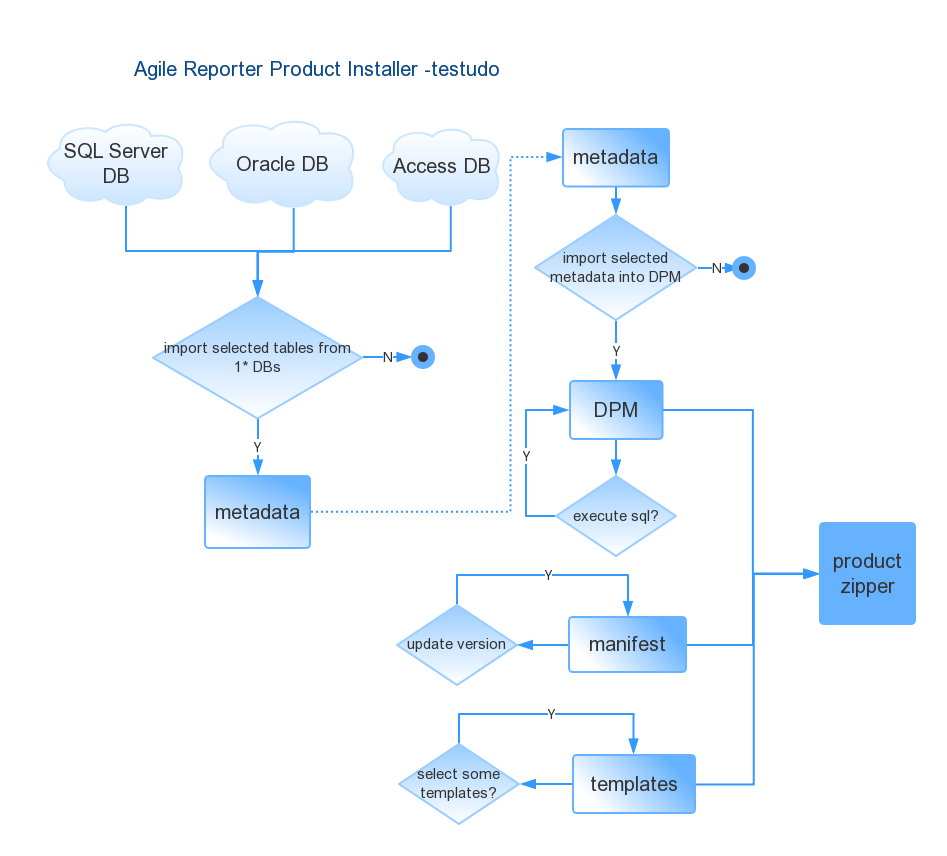

usage 
===
testudo can generates metadata files from many databases(Sql Server, Oracle, Access Database), and then compress necessary files into package(*.zip and *.lrm). It can use on Linux and Windows Oses.
------
	java -jar testudo.jar -Dconf="d:\abc\foo\testudo.json" -Dproject=fed -Did=bbb -Dproc=2 -Drelease -DrunOnJenkins

* [conf]
	* optional
	* conf is defined for full path of configuration file(format is json).
	* get "testudo.json" under the same folder if both [prefix] and [conf] are not provided.
	
* [project]
    * `Highest priority`
	* project is the folder name of product project.
	* get "testudo.json" under this folder.
    
* [id]
	* get the 1st if no provided.
	* id is the key(ID) of [conf](json file[{"ID":"a",...},{"ID":"b",...},{...},...]).
	* support more ids, format like id=id1;id2;id3 
    * id=* means get all ids in this project's "testudo.json".

* [proc]
	* choose "2"  by default if no provided.
	* "1" generates meta-data files. Generate meta-data structure and meta-data.
	* "2" package the files you want. Create access database if need (as dpm), and then create tables defined in metadataStruct(.ini) and import meta-data(*.csv) into dpm, and then execute SQLs if need, package files and generate packages at last.
	* "all" does the "1" and then "2".
    
* [release]
	* optional
	* use this flag -Drelease means release version. It will increase build number, like 1.2.3.4 -> 1.2.3.5
	* use this -Drelease=b2 in jenkins job( package manually , it will adding the value you set, like 1.2.3.4 -> 1.2.3.4-b2
	* does Not use this flag, it will adding a timestamp, like 1.2.3.4 -> 1.2.3.4-1538120420274

* [runOnJenkins]
	* optional
	* use this flag means run on jenkins. It will do everything in the original product folder.
	* does Not use this flag, it will create a copy of product folder, generate packaged files in the copied one without change anything in the original product folder.


json instruction
-------------------------------------------

```json
[
{
  "ID": "its ID",
  
  "prefix": "product prefix, i.e. fed, ecr, MAS, ce, ...",
  
  "metadataPath": "[optional] path of meta-data folder, and which is followed product folder structure, i.e. ...\\ComplianceProduct\\fed\\src\\Metadata",
  
  "metadataStruct": "[optional] the meta-data structure which in under "metadataPath", i.e.FED_FORM_META.ini",
  "databaseServerAndTables":[
  {
   "ID":"1st",
   "databaseServer": {
     "name": "[optional] its Name",
     "driver": "three options: oracle, sqlserver, accessdb",
     "host": "<host name/ip>+@+<service naming> or <host name/ip<+\\+<instance name>, i.e. 172.20.20.49@ora11g, 172.20.20.57\\sql2012",
     "schema": "oracle's schema name, or sqlserver's database name, or accessDb's full name, i.e. ECR_12801_OFFICIAL_SYSTEM",
     "password": "[optional] default value is password."
   },
  
   "requiredTables": {
     "singles": [ "#FormVars", "#Instances", "#InstanceSets", "#RefReturns", "#Rets",
     		"i.e. export ECRFormVars from this database, stored as FormVars.csv as meta-data in metadataPath." ],
     "dividedByReturnIds": [ "#GridKey","#GridRef", "#Ref", "#Sums","#Vals","#XVals", "#XVals", 
     		"items will be exported to meta-data folder and divided by returnId, their exported files' name is table name(without #) with returnId like List_440001.csv",
     ],
     "excludeReturnIds":["360012","360023","list which returnId will be excluded"],
     "notes": "[optional] # means product prefix, "
   }
  },
  {
  	......
  }
  ],
  "zipSettings": {
    "notes": "[optional] anything here",
    "excludeFileFilters":"[optional] like .git;.gitkeep",
    "requiredMetadata": [ "the meta-data(under "metadataPath") which need to imported to dpm, make sure they are all csv; it will search src folder and package all named with returnName+_v+version files if you filter some returnId;",
    	"GridRef\\*.csv",
    	"GridRef\\.csv",
    	"Sums\\*01*.csv",
    	"ExportFormatModule.csv",
    	......
     ],
    "externalProjects":[{"project":"ecrxbrl","srcFile":"MAS_FORM_META.7z","destDir":"dpm","uncompress":"yes","notes":"[optional] put uncompressed srcFile to a destDir dpm which under src by default, can be not existed folder"},               {"project":"ecrxbrl","srcFile":"xbrl.7z","destDir":"xbrl","uncompress":"yes","notes":"[optional] anything here"},
    {"project":"ecrxbrl","srcFile":"sqls","destDir":"sqls","uncompress":"no","notes":"[optional] copy srcFile sqls(folder) to destDir sqls(folder under src, can be not existed folder)"}],
    "dpmFullPath": "[optional] the full name of this product's dpm, i.e. ...\\ComplianceProduct\\fed\\src\\dpm\\FED_FORM_META.accdb",
    "productProperties": "[optional] the full name of this product's properties. i.e. ...\\ComplianceProduct\\fed\\package.properties",
    "sqlFiles":["[optional] the filtered files or all files under filtered folder will be executed on dpm", "sqls\\*.sql"],
    "zipFiles": ["the filtered files or all files under filtered folder will be packaged",
    	"manifest.xml", 
    	"dpm",
    	"dpm\\*",
    	"BE185_v1",
    	"CIL_VERSION00",
    	......
    ]
  }
},
{
  "ID": "aaa",
  "prefix": "ecr",
  "metadataPath": "E:\\ComplianceProduct\\ecr\\src\\Metadata",
  "metadataStruct": "ECR_FORM_META.ini",
  "databaseServerAndTables":[
  {
	"ID":"1st",
	"databaseServer": {
		"name": "toolset system database",
    	"driver": "oracle",
    	"host": "172.20.20.49@ora11g",
    	"schema": "ECR_12801_OFFICIAL_SYSTEM",
    	"password": "password"
	},
	"requiredTables": {
        "singles": [ "#FormVars", "#Instances", "#InstanceSets",  "#RefReturns",  "#Rets"   ],
        "dividedByReturnIds": [  "#GridKey",   "#GridRef" ],
        "excludeReturnIds":["360012","360023"],
        "notes": "# means prefix"
 	}
  }
  ],
  "zipSettings": {
    "notes": "xxx",
    "excludeFileFilters":"",
    "requiredMetadata": [
      "GridRef\\009.csv",
      "Rets"
    ],
    "sqlFiles":["sqls/New Text Document.sql","sqls/test.sql"],
    "dpmFullPath": "E:\\ComplianceProduct\\ecr\\src\\dpm\\ECR_FORM_META.accdb",
    "productProperties": "E:\\ComplianceProduct\\ecr\\package.properties",
    "zipFiles": [
      "manifest.xml",
      "transforms",
      "forms",
      "dpm"
    ]
  }
},
{
  "ID": "bbb",
  "prefix": "mas",
  "databaseServerAndTables":[
  {
	"ID":"1st",
	"databaseServer": {
		"name": "AR system database",
    	"driver": "sqlserver",
    	"host": "172.20.20.230\\SQL12",
    	"schema": "MAS_22103_2K8T55U_SYSTEM",
    	"password": "password"
	},
	"requiredTables": {
     "singles": [ "#FormVars", "#Instances", "#InstanceSets",  "#RefReturns",  "#Rets"   ],
     "dividedByReturnIds": [  "#GridKey",   "#GridRef" ],
     "excludeReturnIds":["360012","360023"],
 	}
  },
  {
	"ID":"2st",
	"databaseServer": {
		"driver": "accessdb",
		"schema": "F:\\ComplianceProduct\\mas\\MAS_FORM_META.accdb"
	},
	"requiredTables": {
		"singles": ["Taxonomy","CFG_CONFIG_DEFINED_VARIABLES"],
		"dividedByReturnIds": [],
		"excludeReturnIds":[],
	}
  }
  ],
  "zipSettings": {
    "excludeFileFilters": ".git;.gitkeep",
    "externalProjects":[{"project":"masxbrl","srcFile":"MAS_FORM_META.7z","destDir":"dpm","uncompress":"yes"},{"project":"masxbrl","srcFile":"sqls","destDir":"sqls"}],
    "requiredMetadata": [
      "GridRef\\009.csv",
      "Rets"
    ],
    "sqlFiles":["test.sql"],
    "zipFiles": [
      "manifest.xml",
      "transforms",
      "forms",
      "dpm"
    ]
  }

]
```
example [testudo.json](testudo.json)

sql instruction
-------------------------------------------
we use UCanAccess for pure read/write Access database, sql statements's format need like [test.sql](test.sql)

